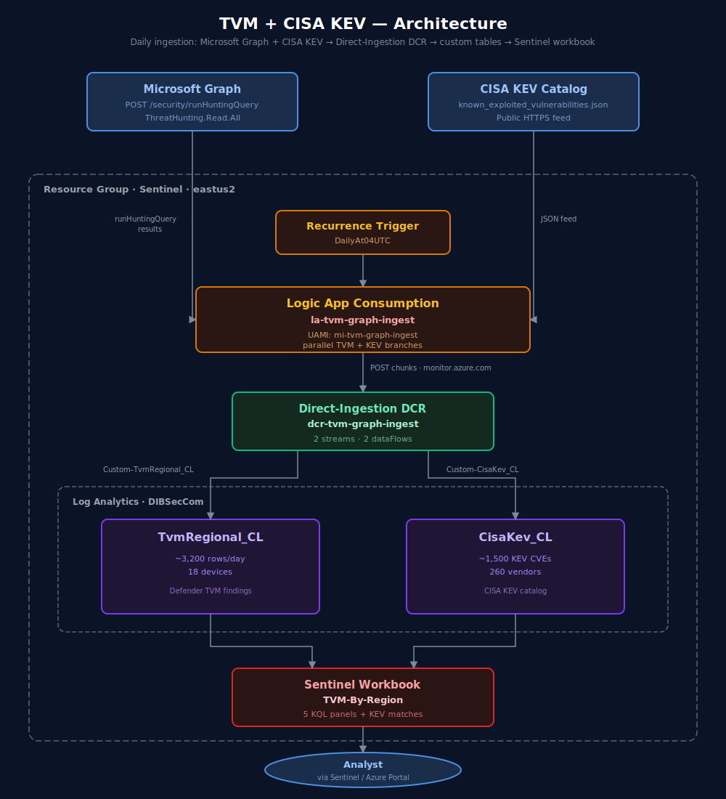
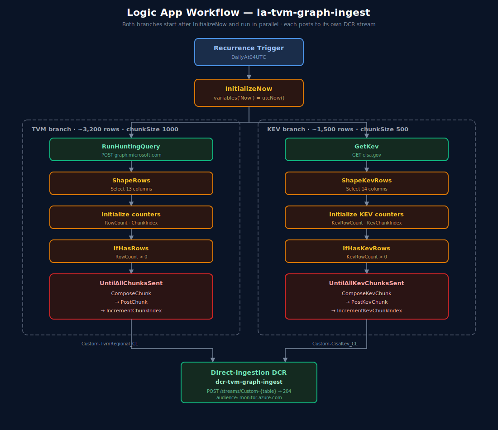
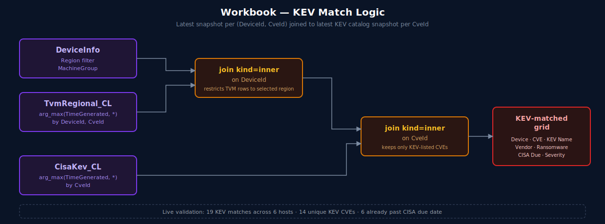

# Threat & Vulnerability Management + CISA KEV Workbook

A Microsoft Sentinel workbook ([`MDE_TVM_Regional_Vulnerability_Workbook.workbook.json`](MDE_TVM_Regional_Vulnerability_Workbook.workbook.json)) that surfaces **Defender for Endpoint TVM** vulnerabilities by `MachineGroup` region, joined against the **CISA Known Exploited Vulnerabilities (KEV)** catalog so analysts can see exactly which hosts are exposed to actively-exploited CVEs.

The data plane is a single **Logic App + Direct-Ingestion DCR** that pulls TVM via Microsoft Graph [`runHuntingQuery`](https://learn.microsoft.com/en-us/graph/api/security-security-runhuntingquery) and the public CISA KEV JSON feed, then writes both into custom analytics tables in the Sentinel workspace.

> **Authentication stance:** UAMI + RBAC only. **No** storage shared keys, **no** SAS, **no** Function keys, **no** client secrets, **no** App Registration credentials.

### Why CISA Known Exploited Vulnerabilities (KEV) Catalog?

The [**CISA Known Exploited Vulnerabilities Catalog**](https://www.cisa.gov/known-exploited-vulnerabilities-catalog) is the authoritative U.S. government list of CVEs with **reliable evidence of active exploitation in the wild**. Unlike raw CVSS, KEV is curated from real attacker behavior and carries a **Federal mandate** under [BOD 22-01](https://www.cisa.gov/news-events/directives/bod-22-01-reducing-significant-risk-known-exploited-vulnerabilities) requiring federal civilian agencies to remediate listed CVEs by a specific `DueDate`.

This workbook ingests the catalog into `CisaKev_CL` and **inner-joins it to per-host TVM findings**, so the dashboard answers the highest-signal question first: *which of my devices are exposed to a CVE that adversaries are actively using right now?* Each KEV match in the workbook carries the catalog's `VulnerabilityName`, `KnownRansomwareCampaignUse` flag, and `DueDate` directly from CISA — turning the KEV section into a prioritized, deadline-driven worklist rather than a generic CVSS dump.

---

## Architecture



### Why this shape

| Concern | Resolution |
|---|---|
| `DeviceTvmSoftwareVulnerabilities` is **lake-only** in Sentinel — 0 rows in LAW analytics | Logic App calls Microsoft Graph advanced hunting (which **does** see it) and POSTs the projection to a custom analytics table. |
| Workbook can't POST to Graph (data sources are GET-only for Graph) | The workbook reads the post-ingested `TvmRegional_CL` table directly. |
| KEV catalog changes daily and matters cross-tenant | Same Logic App fetches CISA's public JSON and writes `CisaKev_CL` — co-located with TVM so a single KQL `join` produces the KEV-match grid. |
| Need passwordless auth end to end | UAMI granted Graph app role `ThreatHunting.Read.All` and `Monitoring Metrics Publisher` on the DCR. No secrets stored anywhere. |

---

## Logic App — both branches share `InitializeNow`



The two branches run in parallel because both start with `runAfter: { InitializeNow: [Succeeded] }`. The DCR enforces stream-to-table mapping, so cross-contamination is impossible — each branch posts to its own `streamName` parameter.

---

## Workbook — KEV match logic

The KEV section joins the **latest snapshot per `(DeviceId, CveId)`** in `TvmRegional_CL` to the **latest snapshot per `CveId`** in `CisaKev_CL`, then sorts ransomware-linked KEVs first and soonest CISA due dates first.



**Live validation:** 19 KEV matches across 6 hosts, 14 unique KEV CVEs, 6 already past CISA due date.

---

## Repository contents

| File | Purpose |
|---|---|
| [`deploy-tvm-graph-ingest.bicep`](deploy-tvm-graph-ingest.bicep) | UAMI · `CisaKev_CL` custom table · DCR (2 streams, 2 dataFlows) · Logic App · role assignments |
| [`tvm-graph-ingest.workflow.json`](tvm-graph-ingest.workflow.json) | Logic App workflow definition (TVM + KEV branches sharing `InitializeNow`) |
| [`grant-graph-permission.ps1`](grant-graph-permission.ps1) | Idempotent grant of Graph `ThreatHunting.Read.All` app role to the UAMI |
| [`deploy-tvm-workbook.bicep`](deploy-tvm-workbook.bicep) | Publishes the workbook via `loadTextContent()` of the JSON |
| [`MDE_TVM_Regional_Vulnerability_Workbook.workbook.json`](MDE_TVM_Regional_Vulnerability_Workbook.workbook.json) | Workbook source (Region/Device/Lookback parameters · TVM panels · CISA KEV section) |
| [`images/`](images/) | Architecture and workflow diagrams (SVG) |

---

## Deployment

> Replace the parameter defaults in [`deploy-tvm-graph-ingest.bicep`](deploy-tvm-graph-ingest.bicep) and [`deploy-tvm-workbook.bicep`](deploy-tvm-workbook.bicep) with your subscription, RG, and workspace.

```powershell
$sub = '<your-subscription-id>'
$rg  = 'Sentinel'

# 1. Deploy UAMI, custom table, DCR, Logic App, and role assignments
az deployment group create -g $rg --subscription $sub `
    --template-file .\deploy-tvm-graph-ingest.bicep

# 2. Grant Microsoft Graph ThreatHunting.Read.All to the UAMI (admin consent equivalent)
.\grant-graph-permission.ps1

# 3. Publish the workbook
az deployment group create -g $rg --subscription $sub `
    --template-file .\deploy-tvm-workbook.bicep

# 4. Trigger the first run manually (Recurrence next fires at 04:00 UTC)
az rest --method POST `
    --uri "https://management.azure.com/subscriptions/$sub/resourceGroups/$rg/providers/Microsoft.Logic/workflows/la-tvm-graph-ingest/triggers/DailyAt04UTC/run?api-version=2019-05-01"
```

### Validation

```kql
// TVM ingestion
TvmRegional_CL
| summarize Rows=count(), Devices=dcount(DeviceId), Cves=dcount(CveId), Latest=max(TimeGenerated)

// KEV ingestion
CisaKev_CL
| summarize Rows=count(), Cves=dcount(CveId), Vendors=dcount(VendorProject), Latest=max(TimeGenerated)

// KEV-matched hosts (mirror of the workbook panel)
let LatestKev = CisaKev_CL | where isnotempty(CveId) | summarize arg_max(TimeGenerated, *) by CveId;
let LatestTvm = TvmRegional_CL
    | where TimeGenerated > ago(7d)
    | where isnotempty(DeviceId) and isnotempty(CveId)
    | summarize arg_max(TimeGenerated, *) by DeviceId, CveId;
LatestTvm
| join kind=inner LatestKev on CveId
| project DeviceName, CveId, VulnerabilityName, VendorProject, KnownRansomwareCampaignUse, DueDate
```

---

## Operational notes

- **DCR data-plane cache.** When you add a new stream/dataFlow to the DCR, the Logs Ingestion endpoint can take ~5 minutes to pick up the change. The first 1–2 runs may return `400 InvalidStream` even though the ARM control plane shows the stream — wait, then re-trigger.
- **Custom table must pre-exist.** The DCR validates that destination tables exist at deployment time, so [`deploy-tvm-graph-ingest.bicep`](deploy-tvm-graph-ingest.bicep) declares `CisaKev_CL` (`Microsoft.OperationalInsights/workspaces/tables@2025-02-01`) **before** the DCR and uses `dependsOn` on the DCR.
- **DCR location must match workspace region.** UAMIs cannot be moved across regions, so pin `param location = '<workspaceRegion>'` rather than relying on `resourceGroup().location`.
- **Recurrence fires on creation.** The Logic App fires its `Recurrence` trigger immediately when first deployed, before role assignments propagate. The first run usually fails on [`RunHuntingQuery`](https://learn.microsoft.com/en-us/graph/api/security-security-runhuntingquery) (Forbidden) — re-trigger after the role assignment lands.
- **CISA KEV feed is anonymous HTTPS.** No auth required; the GET sends `Accept: application/json` and a friendly `User-Agent`.

---

## Architecture decisions that were tried and abandoned

| Approach | Why it was abandoned |
|---|---|
| Sentinel **Summary Rule** over `DeviceTvmSoftwareVulnerabilities` | Source table is 0 rows in LAW analytics tier in this tenant — Summary Rule had nothing to summarize. |
| Sentinel **KQL Job** writing to `TvmRegional_KQL_CL` | TVM tables are not in the data lake System Tables tier in this tenant. |
| Workbook **Sentinel Data Lake** data source | Workbook source has a per-tenant table allowlist that excludes `DeviceTvmSoftwareVulnerabilities` even though the table is queryable from Defender's Data Lake KQL page. |
| Workbook **Custom Endpoint** to a Function App proxy (`func-tvm-xdr-hunt-proxy`) | Workbook Custom Endpoints can't acquire/forward an Entra Bearer token for a custom audience; EasyAuth blocked every workbook call. The whole proxy stack was decommissioned. |
| Workbook **Microsoft Graph** data source | Graph data source supports GET/GETARRAY only; cannot POST to [`runHuntingQuery`](https://learn.microsoft.com/en-us/graph/api/security-security-runhuntingquery). |

The final Logic App + DCR design is the only path that satisfies "no source-table dependency, no secrets, queryable from a workbook."

---

## Acknowledgments

This repository was built collaboratively with **GitHub Copilot** ([@Copilot](https://github.com/Copilot)) — diagrams, Bicep, Logic App workflow JSON, workbook KQL, and README content were authored interactively in VS Code with Copilot as a pair-programming partner. AI co-authorship is recorded via `Co-authored-by:` trailers on the relevant commits.

---

## License

MIT
