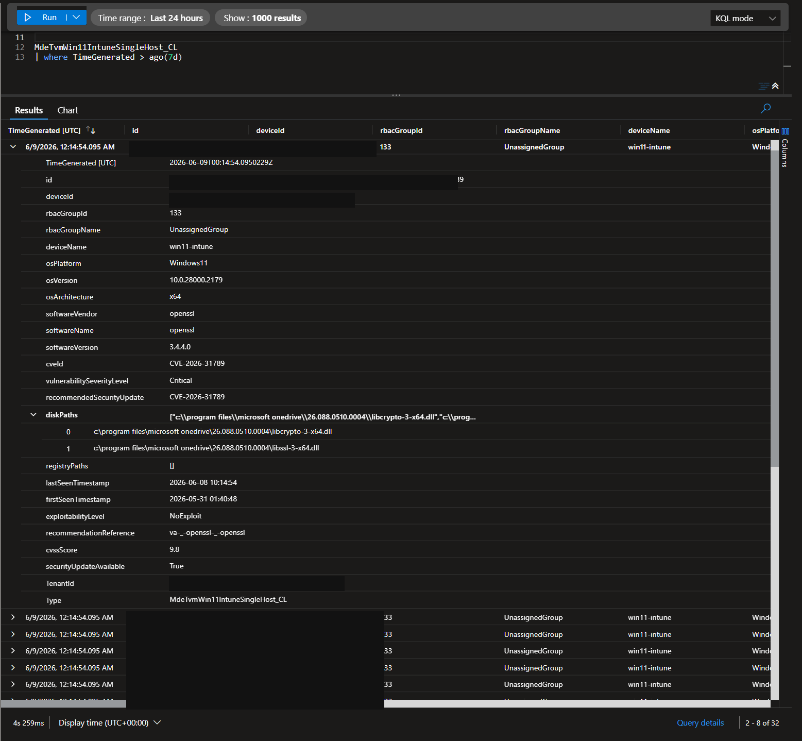

# 💻 Single-Host TVM Ingestion

This folder contains a local-only example deployment for publishing Microsoft Defender Vulnerability Management findings for one host, `WIN11-INTUNE`, into a dedicated Log Analytics custom table. The folder is intentionally ignored by git because it is machine- and tenant-specific deployment scaffolding.

## Use Case

The main workbook deployment ingests broader TVM data for regional reporting. This example is narrower: it proves and documents a single-host path for `WIN11-INTUNE`, using the same user-assigned managed identity as the workbook pipeline, but writing to a separate table so architects and operators can validate host-level enrichment without mixing it into the production workbook tables.

This is useful for:

- Testing Defender XDR TVM API access with managed identity.
- Validating Logs Ingestion API and Direct DCR behavior against one device.
- Demonstrating the minimum components needed to publish Defender TVM records into Log Analytics without secrets.
- Keeping a clean sample table for workbook/query experiments.

## Components

| Component | Name / File | Purpose |
| --- | --- | --- |
| User-assigned managed identity | `mi-tvm-graph-ingest` | Shared identity used by the Logic App to call Defender XDR and post to the DCR. |
| Logic App Consumption workflow | `la-tvm-win11-intune` / `logicapp-machine.json` | Runs daily, calls the Defender TVM API, filters to `WIN11-INTUNE`, shapes rows, and posts them to Logs Ingestion. |
| Direct Data Collection Rule | `dcr-tvm-win11-intune-sh` | Receives JSON over the built-in Logs Ingestion endpoint and routes it to the custom table. `kind` is `Direct`, so no Data Collection Endpoint is required. |
| Custom Log Analytics table | `MdeTvmWin11IntuneSingleHost_CL` / `deploy-tvm-machine-win11-intune-table.bicep` | Dedicated Analytics table for this single-host example. |
| Infra deployment template | `deploy-tvm-machine-win11-intune.bicep` | Deploys the DCR, role assignment, and Logic App in the hosting subscription while pointing the DCR destination to the workspace. |
| Deployment wrapper | `deploy-tvm-machine-win11-intune.ps1` | Resolves subscription names, ensures the hosting resource group exists, deploys the table, then deploys the DCR and Logic App. |
| Defender app-role grant helper | `grant-defender-xdr-tvm-permission.ps1` | Grants the UAMI the Defender XDR application role required to read TVM data. |
| Manual trigger helper | `invoke-tvm-machine-win11-intune.ps1` | Starts the Logic App trigger on demand for validation. |

## Architecture Flow

1. The Logic App `DailyAt04UTC` recurrence starts the workflow.
2. The workflow initializes a single timestamp used as `TimeGenerated` for all rows in that run.
3. `Get_MDVM_Page` calls the commercial Defender XDR API:

   ```text
   GET https://api.security.microsoft.com/api/machines/SoftwareVulnerabilitiesByMachine?pageSize=50000&$filter=deviceName eq 'WIN11-INTUNE'
   ```

4. The Logic App authenticates to Defender XDR using the UAMI and the Defender token audience:

   ```text
   https://api.securitycenter.microsoft.com
   ```

   The endpoint and token audience are intentionally different. Some Defender for Endpoint APIs still require tokens issued for the legacy `api.securitycenter.microsoft.com` resource even when the HTTP endpoint is `api.security.microsoft.com`.

5. `Filter_Target_Machine` applies a second, case-insensitive Logic App filter on `deviceName` so only the target host is posted, even if the API returns broader data.
6. `ShapeRows` projects the Defender response into the DCR/table schema.
7. `If_Has_Rows` posts the shaped array to the Direct DCR stream:

   ```text
   Custom-MdeTvmWin11IntuneSingleHost_CL
   ```

8. The Direct DCR routes the stream to the Log Analytics workspace destination and outputs to:

   ```text
   MdeTvmWin11IntuneSingleHost_CL
   ```

## Identity And RBAC

The deployment is passwordless. There are no shared keys, SAS tokens, client secrets, app registrations with stored credentials, or Function keys.

The shared UAMI needs these permissions:

| Permission | Scope | Why |
| --- | --- | --- |
| `Vulnerability.Read.All` application role on `WindowsDefenderATP` | Microsoft Defender XDR service principal | Allows the UAMI to call the Defender TVM API with application context. The helper script grants this through Microsoft Graph app role assignment APIs. |
| `Monitoring Metrics Publisher` Azure RBAC role | The DCR resource | Required by the Logs Ingestion API for posting to a DCR stream. The Bicep template creates this role assignment. |

The operator deploying the solution needs enough Azure RBAC to create or update:

- The custom table in the Log Analytics workspace resource group.
- The DCR, DCR-scoped role assignment, and Logic App in the hosting resource group.
- The Defender XDR app-role assignment to the UAMI, which requires an Entra role such as Cloud Application Administrator, Application Administrator, or Privileged Role Administrator.

## Bicep Deployment Shape

The deployment is intentionally split because the table and workload resources can live in different subscriptions or resource groups:

- `deploy-tvm-machine-win11-intune-table.bicep` runs at the workspace resource-group scope and creates `MdeTvmWin11IntuneSingleHost_CL`.
- `deploy-tvm-machine-win11-intune.bicep` runs at the hosting resource-group scope and creates the Direct DCR, DCR role assignment, and Logic App.
- `workspaceResourceId` is passed into the DCR template so the DCR can deliver to the existing Log Analytics workspace without hard-coding any subscription or tenant identifiers in documentation.
- The UAMI is referenced as an existing cross-scope resource by name, subscription id parameter, and resource group parameter.

## DCR Details

The DCR is `kind: Direct`, so the Logs Ingestion endpoint is built into the DCR itself. The deployment does not require a Data Collection Endpoint.

The DCR declares one stream:

```text
Custom-MdeTvmWin11IntuneSingleHost_CL
```

The data flow uses a pass-through transform:

```text
source
```

The output stream matches the custom table stream name, causing the rows to land in:

```text
MdeTvmWin11IntuneSingleHost_CL
```

Operational note: when a stream is added or changed, the Logs Ingestion data plane can lag behind the ARM control plane. A new or changed stream can briefly return `InvalidStream` even after deployment succeeds. Retrying after a few minutes usually clears it. In this example, creating a fresh DCR avoided stale stream cache during validation.

## Validation Queries

Use these queries in the destination Log Analytics workspace.

```kql
MdeTvmWin11IntuneSingleHost_CL
| where TimeGenerated > ago(7d)
| summarize
    Rows = count(),
    Devices = dcount(deviceId),
    Cves = dcount(cveId),
    Latest = max(TimeGenerated),
    DeviceNames = make_set(deviceName, 10)
```

```kql
MdeTvmWin11IntuneSingleHost_CL
| where TimeGenerated > ago(7d)
| project TimeGenerated, deviceName, cveId, vulnerabilitySeverityLevel, softwareVendor, softwareName, softwareVersion
| take 10
```

Expected shape from the validated run:

```text
Rows: 32
Devices: 1
Cves: 20
DeviceNames: ["win11-intune"]
```

### Query Result Screenshot

The screenshot below shows the validated Log Analytics result set for the single-host table. Device identifiers and tenant-specific values are redacted, while the query, table name, host name, CVE, software, severity, and row count context remain visible for architectural review.



## Example TVM Record

This example is sanitized. It shows the shape of one row from `WIN11-INTUNE` without exposing subscription ids, tenant ids, DCR immutable ids, workspace ids, or full device identifiers.

```text
{
  "TimeGenerated": "2026-06-09T00:14:54.0950229Z",
  "id": "<redacted-record-id>",
  "deviceId": "<redacted-device-id>",
  "rbacGroupId": 0,
  "rbacGroupName": "<redacted-or-empty>",
  "deviceName": "win11-intune",
  "osPlatform": "Windows11",
  "osVersion": "<redacted-os-version>",
  "osArchitecture": "x64",
  "softwareVendor": "openssl",
  "softwareName": "openssl",
  "softwareVersion": "3.4.4.0",
  "cveId": "CVE-2026-31790",
  "vulnerabilitySeverityLevel": "High",
  "recommendedSecurityUpdate": "<vendor update guidance>",
  "recommendedSecurityUpdateId": "<update-id-or-empty>",
  "recommendedSecurityUpdateUrl": "<update-url-or-empty>",
  "diskPaths": "[]",
  "registryPaths": "[]",
  "lastSeenTimestamp": "<redacted-timestamp>",
  "firstSeenTimestamp": "<redacted-timestamp>",
  "endOfSupportStatus": "<empty-or-status>",
  "endOfSupportDate": "<empty-or-date>",
  "exploitabilityLevel": "<reported-level>",
  "recommendationReference": "<recommendation-reference>",
  "cvssScore": "<score>",
  "securityUpdateAvailable": "true",
  "cveMitigationStatus": "<empty-or-status>"
}
```

## Deployment Commands

Typical sequence:

```powershell
# Grant Defender XDR TVM read permission to the shared UAMI if not already present.
.\grant-defender-xdr-tvm-permission.ps1

# Deploy/update the table, DCR, DCR role assignment, and Logic App.
.\deploy-tvm-machine-win11-intune.ps1

# Trigger an on-demand validation run.
.\invoke-tvm-machine-win11-intune.ps1
```

The scripts default to friendly subscription and resource names, but all sensitive resource identifiers should be passed as parameters or resolved at runtime rather than documented in source.

## Architect Notes

- The Logic App and DCR can be deployed in a hosting subscription while the Log Analytics workspace remains in a security subscription.
- The UAMI can be shared with the broader TVM workbook pipeline as long as its RBAC/app-role assignments cover both Defender XDR and the relevant DCR scopes.
- The table schema and stream declaration must match exactly. Logs Ingestion validates column names and types against the DCR stream declaration and output table.
- The Logic App includes both an API-side `$filter` and a client-side `Filter_Target_Machine` action. The client-side filter is the correctness guard.
- Use a dedicated table for example or lab host ingestion. This prevents single-host validation data from changing workbook production metrics.
- Avoid documenting subscription ids, tenant ids, workspace customer ids, DCR immutable ids, or full device ids in architecture notes or examples.
- This solution was created via GitHub Copilot | GPT 5.5 (XHigh) and reviewed by the author (dcodev1702) for accuracy.
